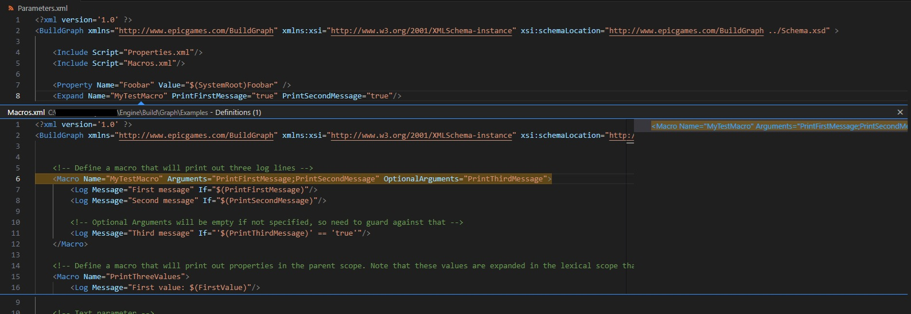

# BuildGraph for VSCode

[](https://code.visualstudio.com/)

A VSCode extension for providing IDE-like "Go to Definition" and "Peek Definition" functionality for Epic Games' BuildGraph XML files.

## Features

This extension provides "Go to Definition" (F12) and "Peek Definition" (Alt+F12) for the following:

* **Variables:** `Ctrl+Click` on a variable like `$(Foobar)` to jump to its definition (`<Property Name="Foobar"...>`, `<Option Name="Foobar"...>`, `<EnvVar Name="Foobar"...>`, etc.).
* **Macros:** `Ctrl+Click` on an `<Expand Name="MyTestMacro"...>` tag to jump to the corresponding `<Macro Name="MyTestMacro"...>` definition.
* **Includes:** `Ctrl+Click` on an `<Include Script="Foobar.xml"...>` to open the included file directly.

The extension follows the `<Include>` dependency tree, ensuring that definitions are searched for in all relevant, included files.



## To Install the `.vsix` File

You can install this `.vsix` file directly:

1.  Open VSCode.
2.  Go to the **Extensions** view (the sidebar icon).
3.  Click the **`...`** (More Actions) menu at the top of the view.
4.  Select **"Install from VSIX..."**
5.  Choose the `.vsix` file you just built.
6.  VSCode will install it and prompt you to reload.

## Development

### Initial Setup

This is the first-time setup you only need to do once after cloning the repository.

1.  **Install Dependencies:** Open the project's root folder in a terminal and run:
    ```bash
    npm install
    ```
    This downloads all the project's development dependencies (like TypeScript and `vsce`) into the `node_modules` folder.

### Modifying & Testing

This is the standard workflow for making changes and testing them live.

1.  **Open Project:** Open the extension's project folder in VSCode.
2.  **Start Debugging:** Press **F5** (or go to `Run > Start Debugging`).
3.  **New Window:** This will compile the TypeScript, start a "watch" task (to re-compile on save), and open a new **[Extension Development Host]** window.
4.  **Test:** In this **new** window, open your *main BuildGraph project folder*. Open an XML file and test your changes.
5.  **Reload Changes:** To see new code changes, simply:
    * Save your `.ts` file.
    * Reload the **[Extension Development Host]** window (go to its Command Palette with `Ctrl+Shift+P` and run `Developer: Reload Window`).

### Packaging

When you're happy with your changes, you can package the extension into a `.vsix` file.

1.  Open the extension's project folder in your terminal.
2.  Run the package script:
    ```bash
    npm run package
    ```
3.  This will create a `.vsix` file in your root folder.

